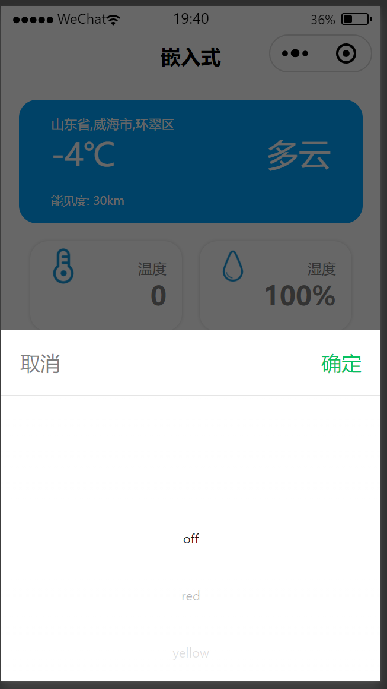
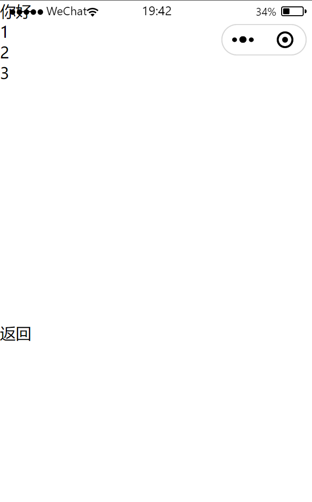
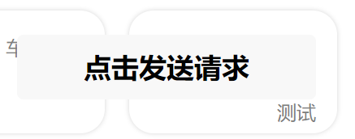
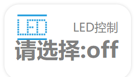

本文件对留下的一些demo进行说明；

### 天气

不再赘述

### LED选择

点击：请选择：off可以进入选择页面

如图所示，选择页面后，触发 index.js 中的LEDChange函数，将数据传到 http://localhost:8080/LED 这个链接，传输的数据是一个数字，off对应0，red对应1，依次类推；

### 车牌检测

点击车牌检测那个框，会跳转到另一个页面

就是这个页面，点击返回可以返回到主页面；

其中 licenseArray 用来存储车牌号，license_img 用来存储图片路径

### 前后端交互

在 index.js 中留下了两个demo，分别是前端从后端获取数据，以及前端向后端发送数据

尽可能使方法以及传送的数据格式多样化了，myh你想用什么就用什么吧

##### 前端从后端获取数据

就是这个玩意儿，点击按钮可以从后端http://localhost:8080/LED 获取数据，获取方法为 GET，当然可以改成 POST，获取数据的样式为 json，当然可以改成别的，修改 header 即可

其函数对应于 index.js 中的 houduan 事件

#####前端向后端发送数据

这个东西向后端发送 id 就是用的这个函数，对应于 index.js 文件中的 LEDChange 事件；以及backend文件夹中，test.java的 getLEDinfo 函数

使用 POST 方法，当然可以改成 GET 方法；传输数据不是 json 格式，这个格式叫什么名字我也不太清楚，在后端使用 request.getParameter("key") 方法获取传过来的信息。当然数据格式也可以修改成 json，改 header 就行

有没有好人能帮我把 css 写了 :grin: